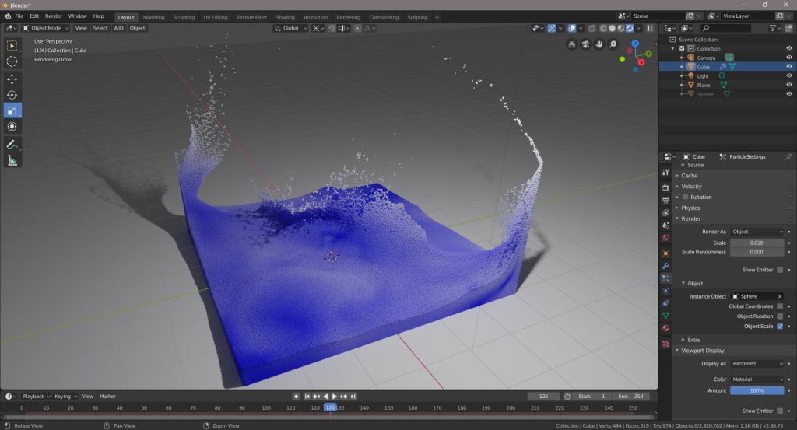

BlenderPartioTools is an open-source add-on to import particle data in Blender. The add-on can handle all file formats that are supported by the [Partio](https://www.disneyanimation.com/technology/partio.html) library.

The add-on requires Blender 2.80 or newer.

This add-on can be used to import and render the particle data generated with our fluid simulation library:
- [https://github.com/InteractiveComputerGraphics/SPlisHSPlasH](https://github.com/InteractiveComputerGraphics/SPlisHSPlasH)

**Author**: [Jan Bender](http://www.interactive-graphics.de), **License**: MIT

## Installation

1. This add-on requires the partio python module. This module can be built by the calling

		python setup.py build_ext
    
	in the directory partio_extension. Note that you have to use the same Python version as your Blender version uses (for Blender 2.80 this is Python 3.7).
    
2. Copy the generated file _partio.* (name depends on system) and the file partio.py to the Blender add-on folder.

3. Copy the file addon/BlenderPartioTools.py to the Blender add-on folder.

4. Start Blender and load add-on (Edit/Preferences/Add-ons)

## Usage

After loading the add-on a new importer appears. To import partio data do the following steps:

1. Click on "File/Import/Partio Import".
2. Choose particle redius and maximum velocity (for coloring).
3. Choose partio file (the add-on assumes that the last number in the file name is the frame number).

## Remarks

* Blender resets the particle system in frame 1. Therefore, the animation will start in frame 2 and all frame numbers are shifted by 1 (i.e. in frame 2 the file example_1.bgeo is loaded).
* The add-on generates a hidden cube as emitter and renders the particles as spheres. If the radius should be adapted, edit the render settings of the cube's particle system.
* By default the particle color is determined by the magnitude of the velocity of a particle. You can adapt this by modifying the shader.
